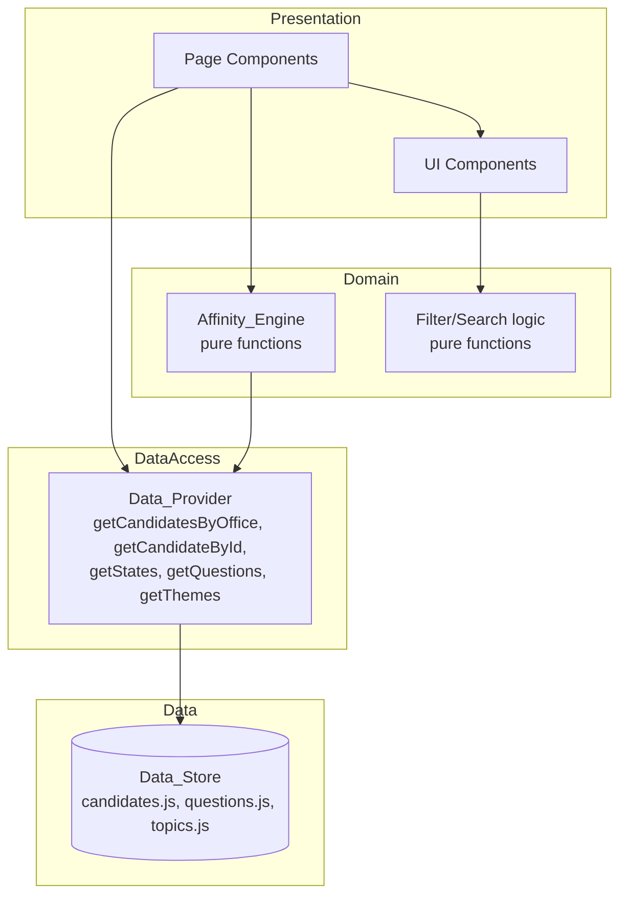
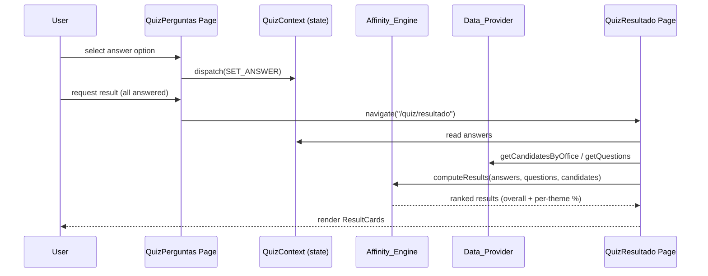
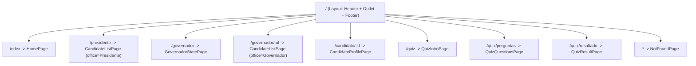

# Design Document

## Overview

**Em Quem Votar** is a client-only React + Vite single-page application (SPA) written in JavaScript. It presents fictional (demonstrative) candidate information for the 2026 Brazilian elections neutrally and comparably, and offers an affinity quiz that compares a User's opinions against candidate positions without recommending a vote.

The design is intentionally layered so that the presentation layer (pages and components) never touches raw data directly. All data access flows through a **Data_Provider** abstraction that today reads from local JavaScript modules (the **Data_Store**) and can later be swapped for an HTTP API or database without changing any page or component. The **Affinity_Engine** is a pure, deterministic module with no UI or storage dependencies, which makes it directly unit- and property-testable.

Key design goals derived from the requirements:

- **No backend, no persistence beyond client memory.** Quiz answers live only in React state and are never transmitted (Req 10.4).
- **Swappable data source.** Components depend on `Data_Provider` functions, not on the shape or location of the underlying files (Req 13.5, 2.3).
- **Deterministic, bounded affinity.** Percentages are always 0–100 and ties break by candidate id (Req 11.2, 11.3, 11.4).
- **Neutrality by construction.** Uniform visual treatment, demonstrative labeling, and no persuasive/recommendation language (Req 14).
- **Mobile-first, accessible, responsive.** Semantic HTML, labeled inputs, alt text, visible focus, centered desktop column (Req 15, 16).

### Technology Stack

| Concern | Choice | Rationale |
|---|---|---|
| Framework | React 18 | Component model, ecosystem, requirement constraint |
| Build tool | Vite | Fast dev server, requirement constraint (`npm run dev`) |
| Language | JavaScript (ESM) | Requirement constraint |
| Routing | React Router v6 | Declarative route mapping for all required paths |
| Styling | CSS Modules + CSS custom properties (design tokens) | Scoped styles, themable palette, no party-color identity |
| State (quiz) | React Context + `useReducer` | Client-only, shared across quiz routes |
| Testing | Vitest + React Testing Library + fast-check | Unit, component, and property-based tests |

## Architecture

The application is organized in four layers. Dependencies point downward only; the presentation layer never imports from the Data_Store directly.



### Layer Responsibilities

- **Presentation (pages + components):** Renders UI, handles user interaction, holds view state. Requests data exclusively through `Data_Provider`. Calls domain functions (`Affinity_Engine`, filter helpers) for computation.
- **Domain (pure logic):** `Affinity_Engine` and filter/search helpers. No React, no I/O, deterministic. Directly testable.
- **Data Access (`Data_Provider`):** A stable function interface. Today it reads synchronous local modules; tomorrow it can return Promises from an API. The interface is designed to be async-friendly (see below).
- **Data (`Data_Store`):** Local JS modules containing fictional candidate, question, and theme data.

### Data-Access Async Readiness

To make the future API swap non-breaking, `Data_Provider` functions are documented as potentially asynchronous. In the MVP they return data synchronously, but page components consume them through a small `useProviderData` hook that tolerates both synchronous values and Promises. This isolates the eventual sync→async transition to one hook rather than every page.

### Request/Navigation Flow (Quiz example)



## Project / Folder Structure

```
em-quem-votar/
├── index.html
├── package.json
├── vite.config.js
├── src/
│   ├── main.jsx                  # App bootstrap + Router
│   ├── App.jsx                   # Route definitions, Header/Footer shell
│   ├── data/                     # Data_Store (fictional data)
│   │   ├── candidates.js
│   │   ├── questions.js
│   │   └── topics.js             # themes + states
│   ├── providers/
│   │   └── dataProvider.js       # Data_Provider interface
│   ├── domain/
│   │   ├── affinityEngine.js     # Affinity_Engine (pure)
│   │   └── candidateFilter.js    # search + ideology filtering (pure)
│   ├── hooks/
│   │   └── useProviderData.js    # sync/async-tolerant data hook
│   ├── context/
│   │   └── QuizContext.jsx       # quiz answers state (reducer)
│   ├── components/               # reusable UI components
│   │   ├── Header/
│   │   ├── Footer/
│   │   ├── CandidateCard/
│   │   ├── CandidateList/
│   │   ├── SearchBar/
│   │   ├── FilterChips/
│   │   ├── CandidateProfileHeader/
│   │   ├── ProfileTabs/
│   │   ├── ProposalCard/
│   │   ├── FinanceCard/
│   │   ├── HistoryTimeline/
│   │   ├── QuizQuestion/
│   │   ├── QuizProgress/
│   │   ├── ResultCard/
│   │   ├── AffinityChart/
│   │   └── DemonstrativeLabel/
│   ├── pages/                    # route-level components
│   │   ├── HomePage.jsx
│   │   ├── GovernadorStatePage.jsx
│   │   ├── CandidateListPage.jsx     # serves /presidente and /governador/:uf
│   │   ├── CandidateProfilePage.jsx
│   │   ├── QuizIntroPage.jsx
│   │   ├── QuizQuestionsPage.jsx
│   │   ├── QuizResultPage.jsx
│   │   └── NotFoundPage.jsx
│   ├── styles/
│   │   ├── tokens.css            # palette + design tokens (CSS custom properties)
│   │   └── global.css
│   └── test/
│       └── generators.js         # fast-check arbitraries for domain data
└── .kiro/specs/em-quem-votar/
```

## Data Models

All data is fictional and lives in the Data_Store. The following schemas describe the record shapes consumed by the Data_Provider and domain layers. Types are documented via JSDoc-style annotations (JavaScript has no static types).

### Theme

Themes organize proposals and quiz questions.

```js
/**
 * @typedef {Object} Theme
 * @property {string} id     - stable key, e.g. "economia"
 * @property {string} label  - display name, e.g. "Economia"
 */
```

Proposal themes (Req 6.1): `saude`, `educacao`, `economia`, `meioAmbiente`, `seguranca`, `habitacao`, `transporte`.
Quiz themes (Req 9.2, 11.3): `economia`, `estado` (Papel do Estado), `seguranca` (Segurança Pública), `meioAmbiente`, `educacao`.

### State (UF)

```js
/**
 * @typedef {Object} StateOption
 * @property {string} uf    - two-letter code, e.g. "SP"
 * @property {string} name  - full name, e.g. "São Paulo"
 */
```

### Candidate

Satisfies Req 13.2, 13.3, 13.4.

```js
/**
 * @typedef {Object} EducationEntry
 * @property {string} graduacao
 * @property {string} universidade
 * @property {number} ano
 *
 * @typedef {Object} Proposal
 * @property {string} theme   - Theme id (proposal theme set)
 * @property {string} text    - proposal description
 *
 * @typedef {Object} FinanceSource
 * @property {string} category   - funding category name
 * @property {number} percentage - 0..100
 *
 * @typedef {Object} Finances
 * @property {number} total          - total raised, in millions (R$ mi)
 * @property {FinanceSource[]} sources
 *
 * @typedef {Object} HistoryEntry
 * @property {number} year
 * @property {string} event
 *
 * @typedef {Object} Positions
 * @property {number} economia      - numeric position weight
 * @property {number} estado
 * @property {number} seguranca
 * @property {number} meioAmbiente
 * @property {number} educacao
 *
 * @typedef {Object} Candidate
 * @property {string} id
 * @property {string} name
 * @property {string} number        - electoral number (string, may have leading zeros)
 * @property {string} party
 * @property {"Presidente da República"|"Governador"} position   - Office
 * @property {string|null} state    - UF for Governador, null for Presidente
 * @property {"Esquerda"|"Centro-esquerda"|"Centro"|"Centro-direita"|"Direita"} ideology
 * @property {string} photo         - image URL/path
 * @property {string} bio           - biography summary
 * @property {EducationEntry[]} education
 * @property {Proposal[]} proposals
 * @property {Finances} finances
 * @property {HistoryEntry[]} history
 * @property {Positions} positions
 */
```

**Position/answer scale.** Positions and quiz answer option values share a common numeric scale. The design uses an integer Likert-style scale of **1..5** (1 = strongly against, 5 = strongly in favor) for both candidate positions per theme and the numeric value carried by each selectable answer option. This shared scale is what makes affinity a well-defined distance computation.

### Quiz Question

```js
/**
 * @typedef {Object} AnswerOption
 * @property {string} id      - option key, e.g. "opt-1"
 * @property {string} label   - display text
 * @property {number} value   - position on the 1..5 scale
 *
 * @typedef {Object} Question
 * @property {string} id
 * @property {string} theme        - quiz Theme id
 * @property {string} text         - question prompt
 * @property {AnswerOption[]} options
 */
```

### Quiz Answer State

Held only in client-side state (Req 10.3, 10.4).

```js
/**
 * @typedef {Object.<string, number>} Answers
 *   Map of questionId -> selected AnswerOption.value (1..5)
 */
```

### Affinity Result

Produced by the Affinity_Engine.

```js
/**
 * @typedef {Object} ThemeAffinity
 * @property {string} theme       - Theme id
 * @property {number} percentage  - 0..100
 *
 * @typedef {Object} AffinityResult
 * @property {string} candidateId
 * @property {number} overall              - 0..100
 * @property {ThemeAffinity[]} byTheme
 */
```

## Data_Provider Interface

The Data_Provider is the single seam between presentation and data. Every function is pure with respect to its inputs (it does not mutate the Data_Store) and returns copies/immutable views so callers cannot corrupt shared data. Functions are documented as async-ready: the MVP returns values synchronously, but signatures and the consuming hook tolerate a Promise return so an API implementation can be dropped in.

```js
// src/providers/dataProvider.js

/**
 * Return all selectable states (UFs) available in the Data_Store.
 * Adding a state to the Data_Store requires no page changes (Req 2.3).
 * @returns {StateOption[]}
 */
export function getStates() { /* ... */ }

/**
 * Return candidates for an office. For "Governador", an optional uf filters by state.
 * @param {"Presidente da República"|"Governador"} office
 * @param {string} [uf] - required-in-effect for Governador list scoping (Req 3.2)
 * @returns {Candidate[]}
 */
export function getCandidatesByOffice(office, uf) { /* ... */ }

/**
 * Return a single candidate by id, or null if not found (Req 4.5).
 * @param {string} id
 * @returns {Candidate|null}
 */
export function getCandidateById(id) { /* ... */ }

/**
 * Return the quiz questions (Req 10.1).
 * @returns {Question[]}
 */
export function getQuestions() { /* ... */ }

/**
 * Return the themes. Callers may request proposal themes or quiz themes.
 * @param {"proposal"|"quiz"} [kind="quiz"]
 * @returns {Theme[]}
 */
export function getThemes(kind) { /* ... */ }
```

Design notes:

- **Immutability:** Provider functions return deep-cloned or frozen structures. This protects the singleton Data_Store from accidental mutation by components and keeps domain functions referentially transparent.
- **Office scoping:** `getCandidatesByOffice("Governador", uf)` performs the state match centrally so pages do not encode data-shape knowledge (Req 3.2).
- **Not-found semantics:** `getCandidateById` returns `null` (never throws) so the profile page can render a friendly not-found view (Req 4.5).
- **Swap path:** Replacing the bodies with `fetch(...)` calls that resolve to the same shapes requires no page changes because pages go through `useProviderData`.

## Affinity Algorithm Design

The Affinity_Engine is a pure module. It converts quiz answers into per-theme user vectors and computes, per candidate, an overall affinity and a per-theme affinity, all bounded 0–100, with deterministic tie-breaking.

### Inputs and Scale

- **Answers:** `questionId -> value` on the 1..5 scale.
- **Questions:** each has a `theme`; multiple questions may share a theme.
- **Candidate positions:** `positions[theme]` on the same 1..5 scale.

The maximum possible distance between two points on a 1..5 scale is `MAX_DELTA = 4`.

### Step 1 — Build per-theme user vector

For each quiz theme, average the values of the answered questions belonging to that theme:

```
userVector[theme] = mean( answers[q.id] for q in questions where q.theme == theme )
```

Themes with no answered questions are excluded from computation (they contribute nothing). This keeps the vector well-defined even for partial data, though the UI requires all questions answered before showing results (Req 10.5).

### Step 2 — Per-theme affinity

For each theme present in the user vector, convert the absolute distance to the candidate's position into a similarity percentage:

```
delta            = abs(userVector[theme] - candidate.positions[theme])
themeAffinity    = round( (1 - delta / MAX_DELTA) * 100 )
```

`delta` ranges 0..4, so `themeAffinity` ranges 0..100. `delta = 0` → 100%; `delta = 4` → 0%.

### Step 3 — Overall affinity

The overall affinity is the mean of the per-theme affinities across the themes present in the user vector:

```
overall = round( mean( themeAffinity[t] for t in userVectorThemes ) )
```

Averaging already-bounded per-theme values keeps `overall` within 0..100.

### Step 4 — Ranking and deterministic tie-breaking

Results are sorted by `overall` descending. When two candidates have equal `overall`, order is decided by candidate `id` using a stable, total comparison (ascending lexicographic `id`). Because `id` is unique, the ordering is fully deterministic and reproducible (Req 11.4).

```
sort by (-overall, id ascending)
```

### Rounding note

Rounding is applied at the reporting boundary (per-theme and overall) so displayed integers stay in 0..100. Tie-breaking operates on the rounded `overall` to match what the user sees, then falls back to `id`.

```mermaid
flowchart LR
    A[Answers 1..5] --> B[Per-theme user vector<br/>mean of answers]
    B --> C[Per-theme affinity<br/>1 - delta/4]
    C --> D[Overall<br/>mean of theme affinities]
    D --> E[Sort by overall desc,<br/>then id asc]
    E --> F[Ranked AffinityResult&#91;&#93;]
```



### Engine API

```js
// src/domain/affinityEngine.js

/**
 * Compute per-theme user vector from answers.
 * @param {Answers} answers
 * @param {Question[]} questions
 * @returns {Object.<string, number>} theme -> mean answer value
 */
export function buildUserVector(answers, questions) { /* ... */ }

/**
 * Compute affinity for a single candidate.
 * @returns {AffinityResult}
 */
export function computeAffinity(userVector, candidate) { /* ... */ }

/**
 * Compute and rank affinity results for all candidates.
 * @returns {AffinityResult[]} sorted by overall desc, id asc
 */
export function computeResults(answers, questions, candidates) { /* ... */ }
```

## Routing Design

React Router v6 maps every required path (Req 17.3, 17.4). The Header and Footer wrap all routes via a layout element so they appear on every page (Req 17.5).



| Path | Page | Notes |
|---|---|---|
| `/` | HomePage | Logo, headline, office nav, quiz CTA (Req 1) |
| `/presidente` | CandidateListPage | office = "Presidente da República" (Req 3.1) |
| `/governador` | GovernadorStatePage | state picker + Continuar (Req 2) |
| `/governador/:uf` | CandidateListPage | office = "Governador", scoped by `:uf` (Req 3.2) |
| `/candidato/:id` | CandidateProfilePage | tabs; not-found if id unknown (Req 4) |
| `/quiz` | QuizIntroPage | intro + themes + Começar (Req 9) |
| `/quiz/perguntas` | QuizQuestionsPage | questions + progress (Req 10) |
| `/quiz/resultado` | QuizResultPage | guarded: redirect to `/quiz` if incomplete (Req 12.6) |
| `*` | NotFoundPage | control back to `/` (Req 17.4) |

**Route guard for results.** `QuizResultPage` reads quiz state on mount; if not all questions are answered it issues a `<Navigate to="/quiz" replace />` (Req 12.6). This guard is derived from the quiz context, not from a stored flag, so it cannot be spoofed by direct URL entry.

## Components and Interfaces

Every interactive control is a native `button` or `a`/`Link` (Req 16.4). Images receive descriptive `alt` (Req 16.3). Inputs are paired with `label` (Req 16.2).

### Layout & Shared

- **Header** — App logo/nav; rendered on every page. Semantic `<header>` + `<nav>`.
- **Footer** — App footer; rendered on every page. Semantic `<footer>`. Carries global demonstrative note.
- **DemonstrativeLabel** — Renders the exact text "Dados demonstrativos para o MVP" (Req 14.1); used wherever mock content appears (bio, finances, history tabs).

### Candidate Listing

- **SearchBar** — Labeled text input, placeholder "Buscar candidato ou partido..." (Req 3.4). Emits query changes upward.
- **FilterChips** — Ideology filter buttons: Todos, Esquerda, Centro-esquerda, Centro, Centro-direita, Direita (Req 3.6). Native buttons with pressed state.
- **CandidateCard** — Photo (with alt), name, number, office, party, ideology tag; shows state when office is Governador (Req 3.10, 3.11). Whole card is a `Link` to `/candidato/:id` (Req 3.12).
- **CandidateList** — Renders title "Candidatos", subtitle "{count} candidatos disponíveis" (Req 3.3), and either the list of CandidateCards or a no-results message (Req 3.13). Filtering/search is delegated to the pure `candidateFilter` module.

### Candidate Profile

- **CandidateProfileHeader** — Large circular photo, name, number, office, state, party, ideology tag (Req 4.1) plus a back control (Req 4.2).
- **ProfileTabs** — Tab controls Bio, Propostas, Finanças, Histórico (Req 4.3); shows active tab content (Req 4.4). Uses ARIA tab semantics on native buttons.
- **ProposalCard** — One proposal, grouped under its theme; shows "Dados demonstrativos" source text (Req 6.2, 6.3).
- **FinanceCard** — "TOTAL ARRECADADO" as "R$ {value} mi" (Req 7.1); "Origem dos recursos" horizontal bars sized by percentage with category name + % (Req 7.2, 7.3); DemonstrativeLabel (Req 7.4).
- **HistoryTimeline** — Year/event entries in reverse chronological order (Req 8.1, 8.2); "Votações" future placeholder (Req 8.3); DemonstrativeLabel (Req 8.4).

### Quiz

- **QuizQuestion** — Renders a question and its selectable options as native radio inputs with labels (Req 10.1). Reports selection upward.
- **QuizProgress** — Current position vs total (Req 10.2).
- **ResultCard** — A candidate result row: name/photo + overall Affinity_Percentage + embedded AffinityChart (Req 12.2, 12.3).
- **AffinityChart** — Per-theme affinity breakdown as labeled bars (Req 12.3).

### Pages

Each page composes components, pulls data via `Data_Provider` (through `useProviderData`), and holds view-local state (search text, active filter, active tab). `QuizQuestionsPage` and `QuizResultPage` read/write the shared quiz context.

## State Management for the Quiz

Quiz answers must be shared across `/quiz/perguntas` and `/quiz/resultado` and must never leave the client (Req 10.3, 10.4). A single React Context backed by `useReducer` holds the answer map.

```js
// src/context/QuizContext.jsx
const initialState = { answers: {} /* questionId -> value */ };

function reducer(state, action) {
  switch (action.type) {
    case "SET_ANSWER":
      return { ...state, answers: { ...state.answers, [action.questionId]: action.value } };
    case "RESET":
      return initialState;
    default:
      return state;
  }
}
```

Design points:

- **Provider scope:** `QuizProvider` wraps the routed app so both quiz pages share state. State is in-memory only; a page refresh clears it (acceptable for MVP and reinforces "not transmitted / not persisted").
- **No network:** The reducer and context contain zero I/O. There is no effect that serializes answers anywhere (Req 10.4). This is verified by test (no `fetch`/storage calls in the quiz path).
- **Completion derivation:** "All answered" is computed as `every(question => answers[question.id] !== undefined)`. This gates advancing to the result (Req 10.5) and drives the result-page guard (Req 12.6).
- **Advance gating:** `QuizQuestion`/page disables the advance/finish control while the current question is unanswered (Req 10.5).

## Styling / Theming Approach

Styling uses **CSS Modules** for component-scoped styles plus a global **design-token** layer of CSS custom properties, so the palette is defined once and reused. No party colors are used as the primary identity (Req 14.5).

```css
/* src/styles/tokens.css */
:root {
  --color-title: #1b2a4a;        /* dark navy — titles, primary elements (Req 15.3) */
  --color-secondary: #3b6fb6;    /* medium blue — secondary elements */
  --color-bg: #f5f7fb;           /* near-white bluish background */
  --color-card: #ffffff;         /* white cards */
  --color-text-secondary: #6b7890; /* bluish-gray secondary text */
  --radius-card: 16px;           /* rounded corners (Req 15.4) */
  --shadow-card: 0 4px 16px rgba(27, 42, 74, 0.08); /* soft shadow */
  --container-max: 1160px;       /* centered desktop column 1100–1200px (Req 15.2) */
}
```

- **Mobile-first (Req 15.1):** Base styles target small screens; `min-width` media queries progressively enhance for larger viewports.
- **Centered column (Req 15.2):** A `.container` class applies `max-width: var(--container-max); margin-inline: auto;` and horizontal padding.
- **Cards (Req 15.4):** Shared card class uses `--radius-card` and `--shadow-card`.
- **Neutral treatment (Req 14.2, 14.4):** All candidate cards share identical structure and styling; ideology tags use a single neutral tag style (not party colors). Distinct visual zones separate factual info, proposals, and comparison/analysis (Req 14.4) via section styling, not color favoritism.

## Accessibility Approach

Mapped to Requirement 16:

- **Semantic structure (16.1):** `<header>`, `<nav>`, `<main>`, `<footer>`, `<section>`, headings in order.
- **Labeled inputs (16.2):** Search field, state select, and quiz radio groups each have associated `<label>` (or `aria-label` where a visible label is not present, e.g., search uses a visible label or `aria-label`).
- **Alt text (16.3):** Candidate photos use descriptive alt such as `"Foto de {name}, candidato a {office}"`.
- **Native controls (16.4):** Navigation via `Link`, actions via `button`; the candidate card is a `Link` wrapping its content.
- **Visible focus (16.5):** Global `:focus-visible` outline using a token color; never removed without replacement.
- **Hover/focus state (16.6):** Interactive elements define both `:hover` and `:focus-visible` visual states.
- **Tabs:** `ProfileTabs` uses `role="tablist"`/`role="tab"`/`role="tabpanel"` with `aria-selected` and roving focus, implemented on native buttons.

## Neutrality Safeguards

- **Demonstrative labeling (14.1):** `DemonstrativeLabel` renders the exact string "Dados demonstrativos para o MVP" wherever mock content is shown; proposal cards additionally show "Dados demonstrativos" (Req 6.3).
- **Uniform treatment (14.2):** Single shared CandidateCard/profile layout for all candidates.
- **No persuasion (14.3):** No slogans or calls to vote in copy.
- **Forbidden phrases (12.5):** The result view must never contain "Seu candidato é", "Você deveria votar em", or "Vote em". This is enforced by copy review and guarded by an automated test asserting these substrings are absent from rendered result output.
- **No party colors as identity (14.5):** Palette is fixed brand-neutral navy/blue; ideology tags are neutral.
- **Fictional-only data (13.6):** Data_Store contains only invented names/parties/numbers.

## Correctness Properties

*A property is a characteristic or behavior that should hold true across all valid executions of a system — essentially, a formal statement about what the system should do. Properties serve as the bridge between human-readable specifications and machine-verifiable correctness guarantees.*

The properties below were derived from the acceptance-criteria prework. They focus on the parts of the system with meaningful input variation: the pure `Affinity_Engine`, the pure `candidateFilter`/provider logic, data-driven rendering completeness, and neutrality invariants. Purely static UI, visual/CSS, and tooling criteria are covered by example, snapshot, or smoke tests instead (see Testing Strategy).

### Property 1: Filtering satisfies the active predicate conjunction

*For any* candidate set, search query, and ideology filter selection, the filtered result contains exactly those candidates that satisfy every active predicate: the candidate's name or party contains the query (case-insensitive substring), AND (when the filter is not "Todos") the candidate's ideology equals the selected ideology. No matching candidate is omitted and no non-matching candidate is included. With an empty query and "Todos", the result equals the input set.

**Validates: Requirements 3.5, 3.7, 3.8, 3.9**

### Property 2: Provider scopes candidates by office and state

*For any* candidate set, `getCandidatesByOffice(office, uf)` returns exactly the candidates whose `position` equals `office`, and — when `office` is "Governador" and a `uf` is given — whose `state` equals `uf`; no other candidates are returned.

**Validates: Requirements 3.1, 3.2**

### Property 3: Displayed count equals the number of displayed candidates

*For any* candidate set, search query, and ideology filter, the subtitle count "{count} candidatos disponíveis" equals the length of the filtered candidate list that is rendered.

**Validates: Requirements 3.3**

### Property 4: Affinity outputs are bounded 0–100

*For any* answers map and any candidate, every affinity value produced by the Affinity_Engine — the overall percentage and each per-theme percentage — is an integer in the inclusive range [0, 100].

**Validates: Requirements 11.2, 11.3**

### Property 5: Ranking is deterministic, permutation-invariant, and breaks ties by id

*For any* answers map and any candidate set, `computeResults` produces results ordered by overall affinity descending, and any two candidates with equal overall affinity appear in ascending order of candidate `id`. Running the computation twice on the same input, or on any permutation of the input candidates, yields the same ordered sequence of candidate ids.

**Validates: Requirements 11.4**

### Property 6: One affinity result per candidate

*For any* answers map and any candidate set, `computeResults` returns exactly one result per input candidate, and every result's `candidateId` corresponds to an input candidate (a bijection between input candidates and output results).

**Validates: Requirements 11.1**

### Property 7: Per-theme breakdown covers every quiz theme present

*For any* completed answers map and any candidate, the affinity result's `byTheme` list contains one entry for each quiz theme represented in the user vector, and each result entry rendered on the result page shows this per-theme breakdown.

**Validates: Requirements 11.3, 12.3**

### Property 8: Candidate card renders all required fields

*For any* candidate, the rendered CandidateCard contains the candidate's name, electoral number, office, party, and ideology tag, and an image element with non-empty descriptive alt text. *For any* candidate whose office is "Governador", the card additionally contains the candidate's state, and the card links to `/candidato/{id}`.

**Validates: Requirements 3.10, 3.11, 3.12, 16.3**

### Property 9: Profile header renders all required fields

*For any* candidate, the rendered CandidateProfileHeader contains the candidate's name, electoral number, office, state (when applicable), party, and ideology tag, plus a photo with descriptive alt text and a back control.

**Validates: Requirements 4.1, 4.2**

### Property 10: Proposals are grouped correctly by theme

*For any* candidate, the Propostas tab renders one group per theme that has at least one proposal (and no group for themes without proposals), each proposal appears as a separate card under its own theme, the total number of proposal cards equals the number of proposals, and each proposal card shows the source text "Dados demonstrativos".

**Validates: Requirements 6.1, 6.2, 6.3, 6.4**

### Property 11: Finance bars are complete and proportional

*For any* candidate finances, the "Origem dos recursos" section renders exactly one bar per funding source, each bar shows its category name and percentage, and the bar size is a monotonic non-decreasing function of the percentage (0% maps to zero width, 100% maps to full width).

**Validates: Requirements 7.2, 7.3**

### Property 12: Total raised is formatted consistently

*For any* finance total value, the rendered "TOTAL ARRECADADO" string matches the format "R$ {value} mi" containing that value.

**Validates: Requirements 7.1**

### Property 13: History timeline is reverse-chronological

*For any* set of history entries, the rendered timeline lists entries in non-increasing order of year (most recent first), and each entry shows its year and its event.

**Validates: Requirements 8.1, 8.2**

### Property 14: Answer selection is recorded in client state

*For any* sequence of answer selections (question id and chosen option value), the quiz reducer state maps each answered question id to the most recently selected value for that question, and no other entries are present.

**Validates: Requirements 10.3**

### Property 15: Advancement is gated by completeness

*For any* answers state and question set, the control that produces the result is enabled if and only if every question has a recorded answer; while any question is unanswered, advancement to the result is prevented.

**Validates: Requirements 10.5**

### Property 16: Result view never contains recommendation phrases

*For any* answers map and candidate set, the fully rendered result view contains none of the forbidden substrings "Seu candidato é", "Você deveria votar em", or "Vote em".

**Validates: Requirements 12.5**

### Property 17: Results are rendered in descending affinity order

*For any* set of affinity results, the result page renders result rows in non-increasing order of overall affinity, and each row displays its overall Affinity_Percentage.

**Validates: Requirements 12.2**

### Property 18: Every candidate conforms to the Candidate schema

*For any* candidate in the Data_Store, the record contains all required fields with correct types: `id`, `name`, `number`, `party`, `position`, `ideology`, `photo`, `bio`, `education`, `proposals`, `finances`, `history`, `positions`; `positions` contains numeric weights for `economia`, `estado`, `seguranca`, `meioAmbiente`, and `educacao`; and `finances` contains a numeric `total` and a `sources` list where each entry has a string `category` and a numeric `percentage`.

**Validates: Requirements 13.2, 13.3, 13.4**

### Property 19: Unknown paths render the not-found view

*For any* path not in the known route set, the Router renders the NotFoundPage, which contains a control that navigates to "/".

**Validates: Requirements 17.4**

### Property 20: Header and Footer render on every route

*For any* route in the known route set, the rendered page includes both the Header and the Footer.

**Validates: Requirements 17.5**

### Property 21: State options are data-driven

*For any* set of states exposed by the Data_Provider, the Governador state-selection control renders exactly those states as options (adding a state to the Data_Store adds an option with no page change), and selecting a state `uf` then continuing navigates to `/governador/{uf}`.

**Validates: Requirements 2.3, 2.5**

## Error Handling

The application is client-only with no network in the MVP, so error handling focuses on missing/invalid data and invalid navigation rather than I/O failures.

- **Unknown candidate id (Req 4.5):** `getCandidateById` returns `null` (never throws). `CandidateProfilePage` renders a "candidate not found" view with a back/home control when the provider returns `null`.
- **Empty filter/search results (Req 3.13):** `CandidateList` renders an explicit "no candidates found" message when the filtered list is empty, rather than an empty container.
- **Incomplete quiz on result route (Req 12.6):** `QuizResultPage` derives completeness from context; if incomplete it renders `<Navigate to="/quiz" replace />` so the user cannot land on an empty/invalid result.
- **Unknown routes (Req 17.4):** A wildcard route renders `NotFoundPage` with a link back to "/".
- **Missing/partial candidate sub-data:** Tabs defensively render empty-state text when a section (e.g., no proposals, empty history) is absent; the proposal grouping omits empty theme groups by design (Req 6.4).
- **Async-ready data access:** `useProviderData` supports a pending/error shape so that when the provider is later swapped for an API, loading and failure states can be surfaced without restructuring pages. In the MVP the synchronous path resolves immediately.
- **Defensive affinity computation:** If a candidate lacks a position for a theme present in the user vector, the engine treats that theme as maximally distant for that candidate (contributing 0% for the theme) rather than throwing, keeping outputs bounded and total.

## Testing Strategy

The strategy combines property-based tests for the pure/logic-heavy parts, example/component tests for specific UI behavior and navigation, snapshot/visual review for styling, and smoke tests for setup and data-content checks.

### Property-Based Tests

Property-based testing **is appropriate** here because the Affinity_Engine, `candidateFilter`, provider scoping, and several data-driven rendering behaviors are effectively pure functions with large input spaces (arbitrary candidate sets, answer maps, queries, and finance/history data). These reveal edge cases (empty sets, extreme scale values, duplicate overalls, unicode queries) that fixed examples miss.

- **Library:** `fast-check` with Vitest (JavaScript). Property tests will **not** be implemented from scratch.
- **Iterations:** Each property test runs a **minimum of 100 iterations** (fast-check `numRuns: 100` or higher).
- **Generators:** A shared `src/test/generators.js` provides arbitraries for `Candidate`, `Positions` (integers 1..5), `Question`, `AnswerOption`, `Answers` maps, finance sources, history entries, and search queries (including case variations and unicode).
- **Tagging:** Each property test includes a comment tag in the format:
  `// Feature: em-quem-votar, Property {number}: {property_text}`
- **Coverage:** One property-based test implements each of Properties 1–21 above. Component-oriented properties (8, 9, 10, 11, 13, 16, 20) are exercised with React Testing Library rendering inside the fast-check loop.

### Example / Component Tests

Used for specific, non-universal behavior:

- Home page content and navigation (Req 1.1–1.7).
- Static prompts, placeholders, tab labels, quiz intro texts and theme list (Req 2.1, 3.4, 3.6, 4.3, 9.1–9.4, 12.1, 12.4).
- Tab switching shows the correct panel (Req 4.4).
- Back control behavior (Req 4.2), Continuar disabled/enabled transition (Req 2.4).
- Empty-result message (Req 3.13) and unknown-id not-found (Req 4.5) as concrete edge cases.
- Router maps each required path to its page (Req 17.3).
- Quiz completion navigation (Req 10.6) and result-page redirect when incomplete (Req 12.6).

### Security / Privacy Test

- **No transmission of answers (Req 10.4):** A test spies on `fetch`, `XMLHttpRequest`, `navigator.sendBeacon`, `localStorage`, and `sessionStorage`, drives the full quiz answer flow, and asserts none are invoked with answer data. This verifies answers remain in client memory only.

### Accessibility Tests

- Component-level checks that inputs have associated labels (Req 16.2), images have alt text (Req 16.3), interactive controls are native `button`/`a` (Req 16.4), and focus-visible styles exist (Req 16.5, 16.6). An automated a11y assertion pass (e.g., `axe`) runs on key pages (Req 16.1).

### Snapshot / Visual & Smoke Checks

- Palette/token presence and card radius/shadow (Req 15.3, 15.4) via token file assertions; responsive/centered column (Req 15.1, 15.2) via manual/visual review.
- Neutrality visual treatment and no-party-color identity (Req 14.2, 14.4, 14.5) via design review; all candidates rendered through the same component enforces uniformity structurally.
- Data-content smoke checks: at least five candidates (Req 13.1); provider exposes the interface functions and pages import only from `providers/` (Req 13.5); fictional-only data review (Req 13.6).
- Tooling smoke: `npm install` and `npm run dev`/build succeed in CI (Req 17.1, 17.2).
